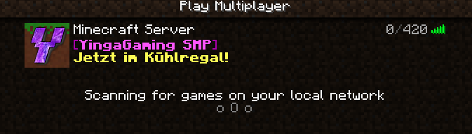

# RandomMOTD

Random MOTDs for Bungeecord

## Usage

Simply define all the MOTDs you want in the config. A random one will be chosen on every ping.

You can reload the config by using ``/rmotd reload``

## Permissions

- randommotd.reload | Reload the config

## Building

To build this plugin yourself, simply run `mvn package`

## Contributing

Contributions are always welcome! Just create a PR!
